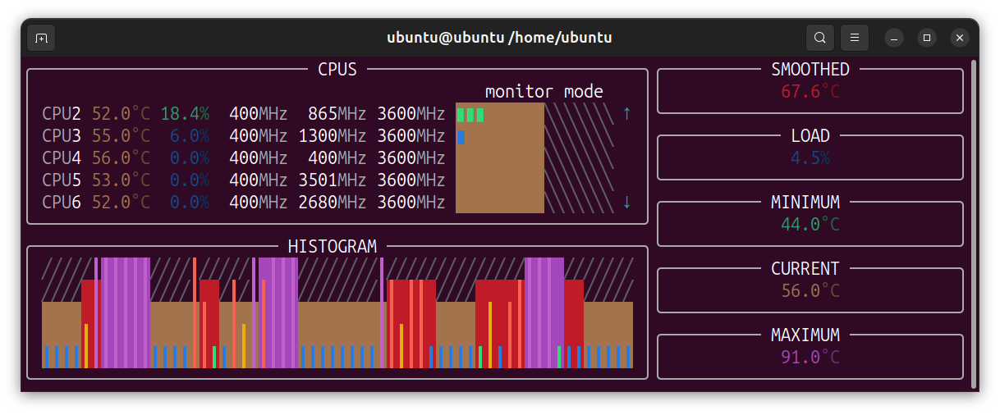
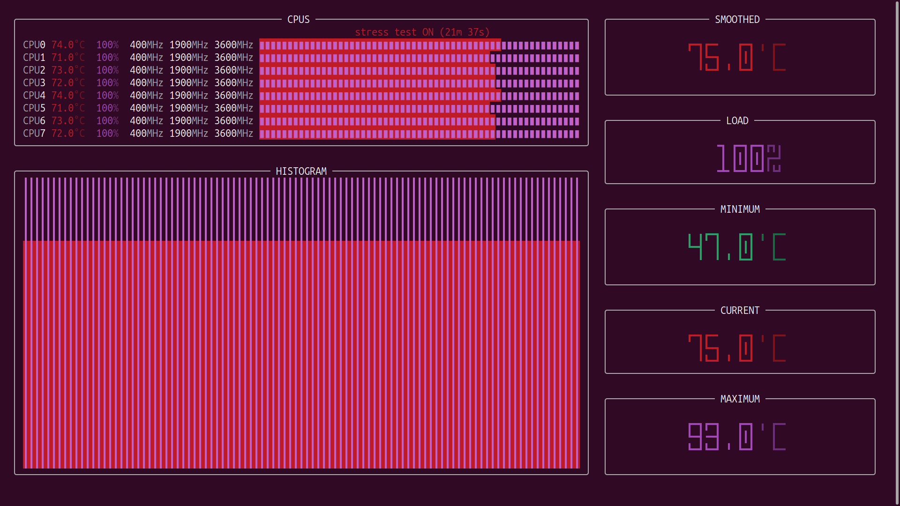
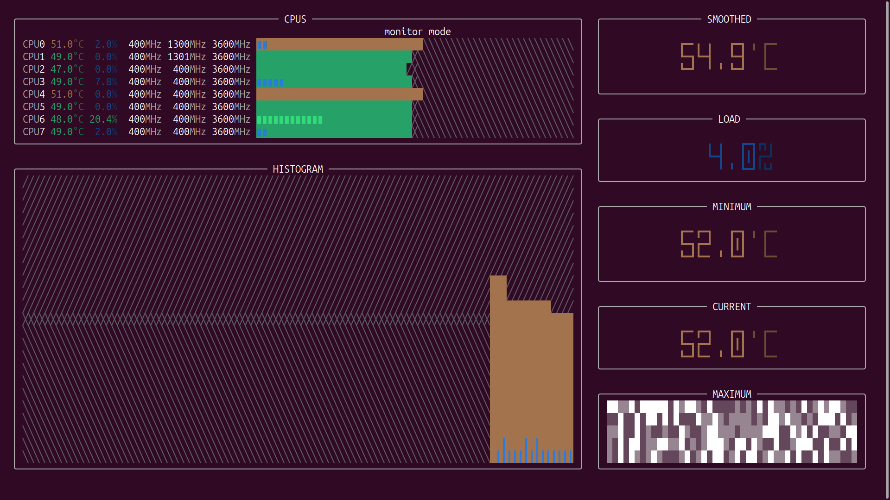
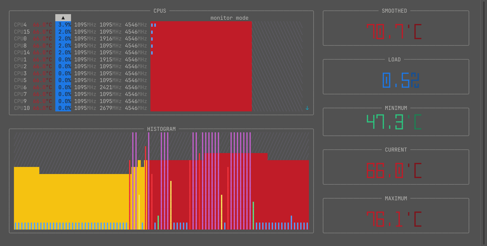
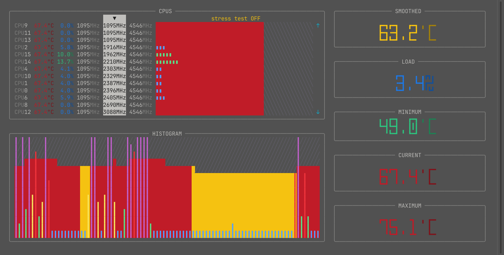
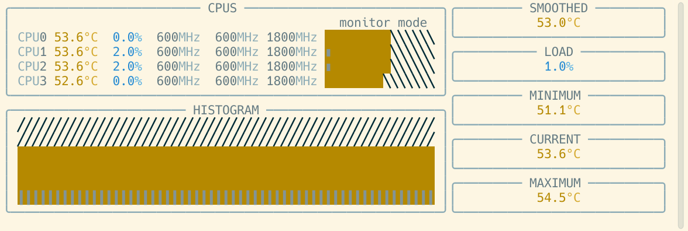
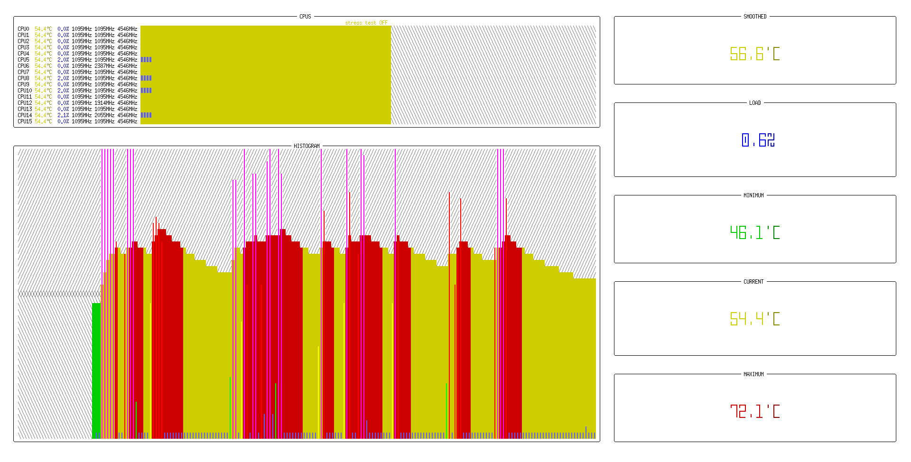

<h1 align="center">KOKOMO</h1>

Kokomo is a Linux terminal tool that lets you monitor CPU temperature and load in real time (monitor mode), and push it to its limits with stress tests (stress mode).

## REQUIREMENTS

A modern Linux distribution with Python 3.13 or newer is required. This should be enough to run the program.

Only two files from this repository are needed: `kokomo` (the executable) and `eva.py` (the only dependency).

You can visit the [Eva](https://github.com/konarocorp/eva) repository to learn more about this toolbox.

## OPTIONS

The following options are available:

* `-f`, `--fahrenheit`

  By default, the program displays temperatures in degrees Celsius. When this option is enabled, temperatures are displayed in degrees Fahrenheit.

* `-h`, `--help`

  Displays a simple help screen and exits.

* `-s`, `--stress`

  By default, the program starts in monitor mode only. To prevent accidental activation, stress tests cannot be started in this mode. This option must be used to enable stress mode. It is important to understand that stress mode does not start a stress test automatically. It only allows a stress test to be started.

## USAGE

When the program starts, several windows are displayed:

* `CPUS`

  Lists all available logical processors, showing temperature, load percentage, minimum scaling frequency, current frequency, and maximum scaling frequency. The bar is a visual representation of the load percentage, overlaid on the temperature display (from 0 to 100 degrees Celsius).

* `HISTOGRAM`

  Displays a histogram showing CPU load and temperature. Its visual representation is the same as the one used for logical processors, but applied to the processor as a whole.

* `SMOOTHED`

  Average CPU temperature over the last few seconds. The current temperature usually changes with each reading. By averaging the last few seconds, possible spikes are smoothed out and a more stable value is obtained.

* `LOAD`

  Overall CPU load expressed as a percentage.

* `MINIMUM`

  Lowest overall CPU temperature recorded since the program started.

* `CURRENT`

  Current overall CPU temperature.

* `MAXIMUM`

  Highest overall CPU temperature recorded since the program started. A brief temperature spike may occur when the program starts, due to the initial CPU load caused by the program itself. For this reason, the maximum temperature reading is ignored and will not be displayed in this window during the first few seconds.

## CONTROLS

If there are many logical processors, they may not fit in the `CPUS` window. In that case, the `UP` and `DOWN` keys or the mouse wheel can be used to scroll.

The `LEFT` and `RIGHT` keys move the focus between the fields in the `CPUS` window. The selected field is used as the sorting criterion. The sorting order can be reversed with the `R` key.

The `SPACE` key starts and stops the stress test (requires stress mode to be enabled).

The `ESC` and `Q` keys can be used to exit the program.

## SCREENSHOTS

 

 

 

 

 

